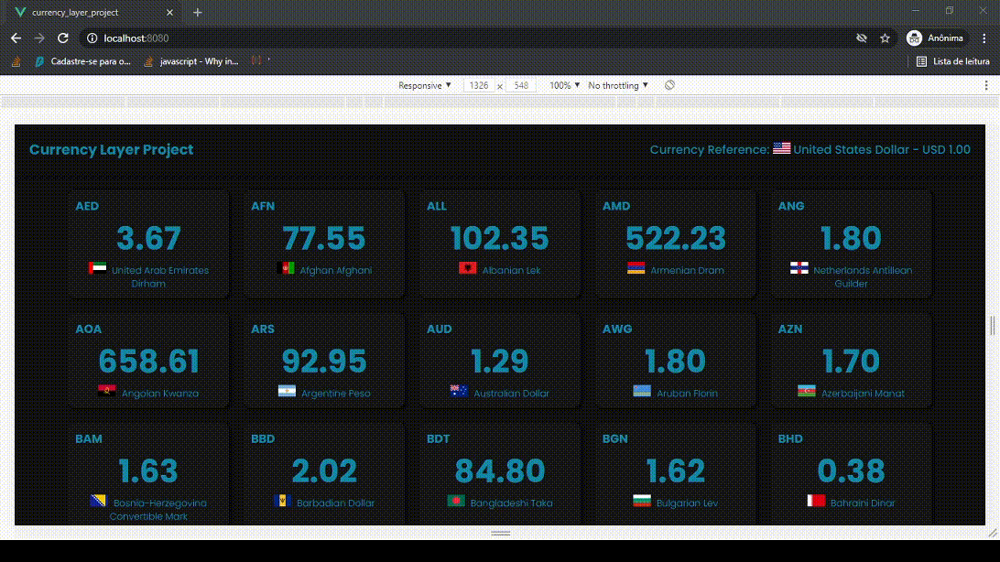

# Currency Layer Project

[](https://github.com/vinisalves/currency-layer/blob/main/LICENSE)
[](https://travis-ci.com/vinisalves/currency-layer)


Currreny Layer is a web responsive project using Vuejs3 + Typescript + NodeJs.
This app fetches currency data from all countries available on [Currency Layer api's](https://currencylayer.com/).

# Web Layout


# Responsive Layout


# Live Demo
[http://apps.vinibr.com/currency-layer/](http://apps.vinibr.com/currency-layer/){:target="_blank"}

# Technologies

## Back end
+ NodeJS
+ Typescript
+ Express
+ DotEnv
+ Axios
+ Jest

## Front end
+ Vuejs3
+ Axios

# Installing
``` bash
git clone https://github.com/vinisalves/currency-layer.git
```
## Back end

```bash
cd currency-layer/backend
npm install
```
## Front end
```bash
cd currency-layer/frontend
npm install
```
# Running
``` bash
cd currency-layer/backend
#concurrently will start frontend and backend
npm run start
```

# Acessing

[http://localhost:8080](http://localhost:8080)


